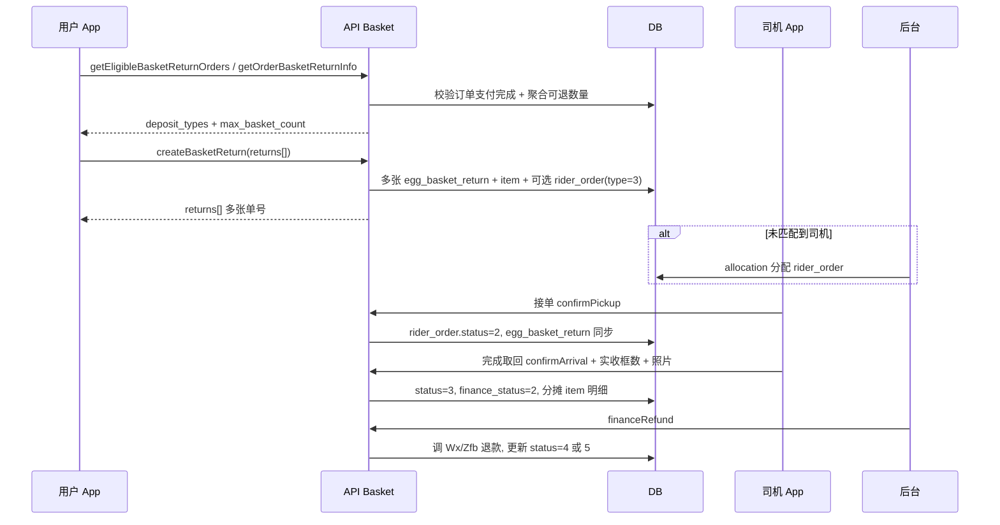

# 押金容器（筐）回收 — 产品需求文档（PRD）与全链路设计

| 项目 | 说明 |
| --- | --- |
| 文档版本 | v1.0 |
| 更新日期 | 2026-04-30 |
| 适用范围 | 笨熊采购 · 用户 App、司机 App、运营后台 |
| 关联文档 | `docs/鸡蛋筐回收-用户端与司机端接口清单.md`（接口字段与示例）、`docs/退押金-后端开发说明.md`（与其它退押金主线区分） |

---

## 1. 背景与目标

### 1.1 背景

用户在购买鲜蛋、豆制品等「带容器押金」的商品并支付后，容器实物需回收才能闭环；平台通过 **预约上门取回 → 司机核销数量 → 财务原路退款** 完成押金退还。早期多为单一「鸡蛋筐」，现已演进为 **按押金类型（多 SKU）管理**，一单可含多种容器押金。

### 1.2 产品目标

- **用户**：在已完成订单上清晰看到「每种容器还可退几只框」，一次可勾选多种类型提交；随时查看进度与退款结果。
- **司机**：与配送任务区分，独立列表承接「押金回收单」，接单、到场取回、填报实际数量与照片。
- **运营 / 财务**：可筛选、分配司机、追踪超时；司机确认后在后台一键触发 **微信 / 支付宝原路退款**（或 Demo 模拟）。
- **平台**：可退数量与订单行、历史回收单挂钩，避免超额退款；类型与单价可配置（`deposit_type` + 商品字段）。

---

## 2. 名词与概念

| 名词 | 含义 |
| --- | --- |
| 押金类型 | 如鸡蛋筐、豆腐框、水桶；对应表 `deposit_type`（代码中 `db_deposit_type`），主键 `id` 写入押金单 `deposit_type` 字段 |
| 押金单 | `egg_basket_return` 一行，**一种押金类型一笔单**；用户一次提交多类型会生成多张押金单 |
| 押金明细 | `egg_basket_return_item`，标明本单从哪些 `order_goods` 行扣减了多少「框」 |
| 可退数量 | 订单行理论框数 − 历史有效回收单已占用框数（取消单 `status=6` 不占） |
| 司机任务 | `rider_order`，`type=3` 表示押金回收；`order_id` 存的是 **押金单 id**（不是商城订单 id） |

---

## 3. 角色与权限

| 角色 | 典型动作 | 权限 / 入口 |
| --- | --- | --- |
| C 端用户 | 列表 → 填数量 → 提交 → 查看详情 / 取消（限状态） | API：`Basket/*`，需 `Token` |
| 司机 | 列表筛选 `order_type=3` → 接单 → 确认取回 → 上传照片与实收框数 | API：`Rider/*`；任务与 `rider_order` 绑定 |
| 运营 | 筛单、分配司机、看详情、导出 | 后台 `BasketReturn/index`，菜单「押金管理」 |
| 财务 | 待退款节点触发原路退款、填写备注 | 后台 `BasketReturn/finance` |
| 商品运营 | 维护押金类型、商品是否押金及类型 | 后台 `DepositType/*`；商品编辑字段 `is_deposit`、`deposit`、`deposit_type` |

---

## 4. 业务流程（端到端）

---

## 5. 功能需求

### 5.1 用户端（C 端）

| ID | 需求 | 说明 |
| --- | --- | --- |
| U-1 | 可退订单列表 | 仅展示「已完成 + 已支付 + 仍存在可退框数」的订单；空列表按 `meta.empty_reason` 区分文案 |
| U-2 | 申请页 | 按 `deposit_types[]` 渲染多行输入；仅提交 `basket_count > 0` 的类型；校验上限来自接口 |
| U-3 | 提交结果 | 展示 `returns[]` 多张单；展示 `assign_notice` |
| U-4 | 我的押金单 | 列表 + 详情；一条类型一条记录 |
| U-5 | 取消 | 仅 `egg_basket_return.status = 1`（待分配司机）可取消 → `status = 6` |

**页面改造要点（前端 / App）**

1. **列表页**：调用 `GET /api/Basket/getEligibleBasketReturnOrders`，卡片展示 `shop_name`、`order_no`、`deposit_types` 摘要、`max_refund_amount`。
2. **申请页**：进入时再调 `GET /api/Basket/getOrderBasketReturnInfo?order_id=` 做实时校验；表单字段对齐 `returns` JSON。
3. **提交**：`POST /api/Basket/createBasketReturn`，Body 含 `order_id`、`returns`（字符串 JSON 或数组）、联系人、地址、预约时间、备注。
4. **记录**：`GET /api/Basket/getBasketReturnList`、`GET /api/Basket/getBasketReturnDetail`。
5. **详情节点文案**：以用户可见的 `status_name`、`finance_status_name` 为准（见接口清单）。

### 5.2 司机端

| ID | 需求 | 说明 |
| --- | --- | --- |
| D-1 | 任务列表 | `order_type=3` 仅押金回收；一条任务对应一张押金单 |
| D-2 | 接单 / 取货 | `confirmPickup`：`type=3` 时更新押金单与 `rider_order` |
| D-3 | 完成取回 | `confirmArrival`：必填 **实际框数** ≤ 申请框数；上传图片；按行分摊更新 `egg_basket_return_item` |

实现参考：`application/api/Model/Rider.php` — `confirmPickup`、`confirmArrival` 中 `type == 3` 分支。

**页面改造要点**

1. 列表增加 Tab 或筛选、「押金退款」任务角标（与 `order_type=3` 一致）。
2. 详情页展示：押金单号、类型名称、申请框数、取货地址、联系人电话。
3. 完成页：输入 **整数实际框数**、多图上传（与现有送达接口字段保持一致）。
4. 提示：押金单状态与 `rider_order.status` 不同步等价（参见接口清单 §2.5）。

### 5.3 运营后台

| ID | 需求 | 说明 |
| --- | --- | --- |
| A-1 | 押金管理列表 | 筛选：手机、单号、状态、财务状态、押金类型、日期；快捷「未取回 / 已取回」 |
| A-2 | 详情 | 用户信息、来源订单、明细行、司机信息 |
| A-3 | 分配司机 | `status in (1,2)` 可分配；写入 `rider_order(type=3)` |
| A-4 | 财务退款 | 满足 `Basket::financeRefund` 前置条件后调用微信/支付宝退款 |
| A-5 | 导出 | Excel 导出当前筛选结果 |
| A-6 | 汇总角标 | `summary` 接口返回待取回数量等（可选前端展示） |

**页面文件（Layui）**

| 页面 | 视图路径 |
| --- | --- |
| 列表 | `application/admin/view/basket_return/index.html` |
| 详情 | `application/admin/view/basket_return/info.html` |
| 财务退款 | `application/admin/view/basket_return/finance.html` |

**改造建议**

- 列表「押金类型」下拉的选项建议改为读取 `deposit_type` 表（当前模板内写死 1/2/3 中文名，与库不一致时会误导）。
- 列表已支持超时标识 `is_pickup_timeout`（创建时间 + 3 天），可在表格列高亮。

### 5.4 押金类型配置（商品侧）

| ID | 需求 | 说明 |
| --- | --- | --- |
| C-1 | 类型字典 | `DepositType` CRUD；停用类型不可用于新建回收单校验 |
| C-2 | 商品绑定 | `product.is_deposit=1`；`deposit_type>0` 优先于品类映射 |

---

## 6. 数据设计

### 6.1 表清单（需创建 / 变更）

ThinkPHP 配置 **`prefix = db_`**，代码里使用 **`db('egg_basket_return')`** 即物理表 **`db_egg_basket_return`**。

| 逻辑名（代码） | 物理表名 | 用途 |
| --- | --- | --- |
| `egg_basket_return` | `db_egg_basket_return` | 押金回收主表 |
| `egg_basket_return_item` | `db_egg_basket_return_item` | 按订单行拆分申请/实收 |
| `deposit_type` | `db_deposit_type` | 押金类型字典 |
| `user_basket_ledger` | `db_user_basket_ledger` | **预留台账，代码未使用** |
| `product` | `db_product` | 增加 `deposit_type` 字段（见 SQL） |

### 6.2 主表核心字段（`db_egg_basket_return`）

| 字段 | 说明 |
| --- | --- |
| `return_no` | 押金单号，唯一，`BK` + 时间 + 随机 |
| `source_order_id` / `source_order_no` | 来源商城订单 |
| `deposit_type` | 对应 `deposit_type.id`，一单一种类型 |
| `apply_basket_count` / `actual_basket_count` | 申请 / 实收框数 |
| `unit_deposit_price` | 头表展示用单价（可能与多 goods 加权平均有关） |
| `apply_refund_amount` / `actual_refund_amount` | 申请 / 实际退款金额 |
| `status` | 业务主状态（见 §7） |
| `pickup_status` | 取货子状态 |
| `finance_status` | 财务节点 |
| `rider_id`、`pickup_images`、`driver_remark` | 司机侧信息 |
| `refund_trade_no`、`refund_result` | 渠道退款凭证 |

### 6.3 明细表（`db_egg_basket_return_item`）

记录本押金单从哪些 `order_goods` 扣减框数；司机确认实收时按 **`id asc`** 顺序把实际框数分摊到各行（`Rider::confirmArrival`）。

### 6.4 司机任务表约定

`rider_order.type = 3`，**`order_id` = `egg_basket_return.id`**。

---

## 7. 状态机

### 7.1 押金单 `egg_basket_return.status`

| 值 | 含义 |
| --- | --- |
| 1 | 待分配司机 |
| 2 | 待司机取回 |
| 3 | 已取回待财务退款 |
| 4 | 已退款 |
| 5 | 退款失败 |
| 6 | 已取消 |

### 7.2 财务 `finance_status`

| 值 | 含义 |
| --- | --- |
| 1 | 未到财务节点 |
| 2 | 待退款 |
| 3 | 已退款 |
| 4 | 退款失败 |

### 7.3 与司机任务的关系

详见 `docs/鸡蛋筐回收-用户端与司机端接口清单.md` §2；后端 creating 时若匹配到原配送司机会直接生成 `rider_order` 并将押金单置为 `status=2`。

---

## 8. 核心业务规则（后端已实现摘要）

1. **订单门槛**：`pay_status=2`、`order_status=5`（已完成）。
2. **商品门槛**：`product.is_deposit=1`，且能解析出 `deposit_type`（商品字段或 `Basket::CATEGORY_DEPOSIT_TYPE_MAP` / 鲜蛋品类默认）。
3. **可退框数**：按订单行 `deposit` 与单价推算框数；减去历史回收单占用（`getUsedOrderGoodsBasketCount`，排除 `status=6`）。
4. **多类型提交**：`returns` 每条 `{deposit_type, basket_count}`；后端按类型 **循环创建多张押金单**，每张单内再拆 `item` 行。
5. **单价**：优先 `product.deposit` 作为单框押金；否则默认常量 `DEFAULT_UNIT_DEPOSIT`（15）。
6. **司机匹配**：优先同源订单 `rider_order.type=1`，否则订单 `rider_id`（`matchSourceDeliveryRider`）。
7. **退款**：`Basket::financeRefund` — 微信 `pay_type=1`，支付宝 `pay_type=2`；拆单支付通过 `parent_order_no` 聚合；Demo 订单号前缀特殊处理。

---

## 9. 接口索引

完整路径、参数、JSON 示例、错误码见：

**`docs/鸡蛋筐回收-用户端与司机端接口清单.md`**

后端控制器：`application/api/controller/Basket.php`  
核心模型：`application/api/Model/Basket.php`

---

## 10. 服务端代码结构（便于 PR 拆分）

| 模块 | 路径 |
| --- | --- |
| 用户 API | `application/api/controller/Basket.php` |
| 领域逻辑 | `application/api/Model/Basket.php` |
| 司机闭环 | `application/api/Model/Rider.php`（`type` 3） |
| 后台 | `application/admin/controller/BasketReturn.php`、`DepositType.php` |
| 联调 Demo | `application/api/controller/BasketDemo.php`（模拟订单与流程） |
| 支付 | `application/common/pay/Wx.php`、`Zfb.php` |

---

## 12. 非功能需求

| 类别 | 要求 |
| --- | --- |
| 安全 | 所有用户接口鉴权；押金单读写校验 `uid` |
| 幂等 | 财务退款应避免重复点击（产品可二次确认；后端可依 `finance_status` 约束） |
| 性能 | 可退订单列表会对用户历史已完成订单扫一遍，量大时可后续改索引或分页策略优化 |
| 审计 | `refund_result` 存渠道原始返回；后台记录财务操作人 |

---

## 13. 验收标准（建议）

1. 新订单含两种押金商品时，用户一次提交生成 **两张** 押金单，`returns` 长度与类型一致。
2. 司机完成取回后，押金单 `status=3`、`finance_status=2`，明细 `actual_basket_count` 之和等于填报总数。
3. 后台财务退款成功后，`status=4`、`finance_status=3`，用户支付渠道可查到退款流水。
4. 用户在 `status=1` 取消成功，列表不再计入可退占用。
5. 停用 `deposit_type` 后，新建回收单返回「押金类型无效或已停用」。

---
