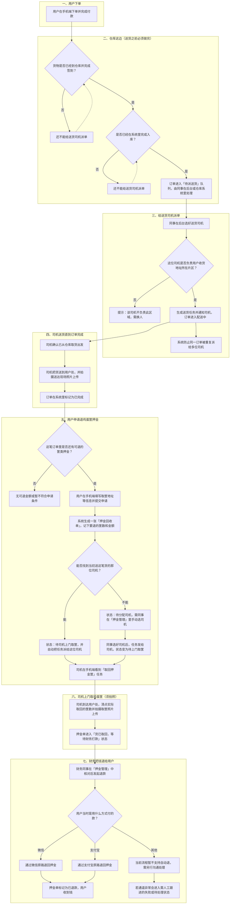
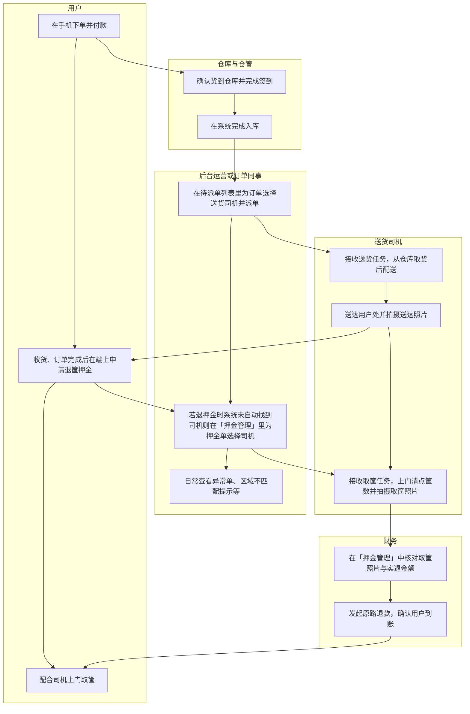

# 订单送货与退鸡蛋筐押金（业务版）

## 一句话说明

1. **送货**：货要先到仓库办好「签到」和「入库」，后台才能给司机派「送货单」；司机把货送到后拍照，订单才算**完成**。
2. **退筐押金**：只有**已付款且已完成**的订单，用户才能申请退鸡蛋筐等押金；系统会**尽量仍派当初送货的那位司机**上门取筐；若找不到这位司机，由**押金管理**里同事手动派司机。司机取走筐并拍照后，**财务**在后台操作，钱按原支付方式退回用户（微信或支付宝）。

---

## 流程图

在支持流程图语法的文档或编辑器中打开本文件即可预览图。

---

## 泳道图版（按角色分工）

横向按「谁做事」分栏，便于开会或培训时投影。若某工具渲染不佳，可将各泳道改为上下排列的多个「泳道」小节，顺序阅读即可。

---

## 泳道图与时间顺序对照（文字版）

若上图连线在个别阅读器中显示不理想，可按下面顺序向非技术同事口述：

| 顺序 | 谁 | 做什么 |
|:---:|:---|:---|
| 1 | 用户 | 下单并付款 |
| 2 | 仓库与仓管 | 货到签到 → 完成入库（两件事都做完才能派送货） |
| 3 | 后台同事 | 给订单指派送货司机（须匹配负责区域） |
| 4 | 司机 | 送货并在送达时拍照 |
| 5 | 用户 | 收货；订单在系统里变为「已完成」后，可申请退筐押金 |
| 6 | 系统优先 / 后台同事 | 尽量派「原送货司机」取筐；派不到则由押金管理里人工派司机 |
| 7 | 司机 | 上门取筐并拍照 |
| 8 | 财务 | 在押金管理里发起退款，钱原路退回用户微信或支付宝 |

---

## 押金单状态

- **待分配司机**：还没定下谁来取筐，需要后台在押金管理里选人。
- **待司机取回**：已通知司机，司机尚未完成取筐与拍照。
- **已取回待财务退款**：筐和照片已齐，等财务点退款。
- **已退款**：钱已退回用户。
- **退款失败 / 已取消**：按界面提示或联系运营、财务处理。
