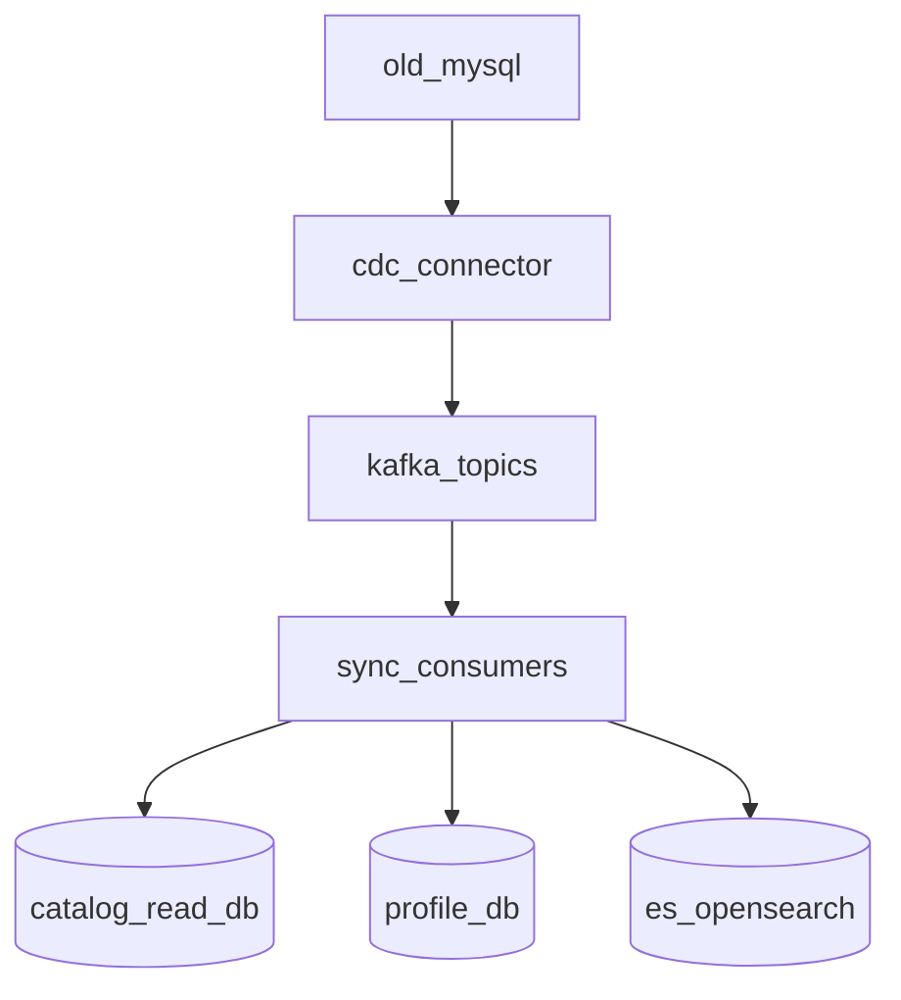

# 数据同步与身份归因方案

## 目标

在不改老 PHP 代码的前提下，为 Go 推荐平台建立稳定的数据来源、统一身份体系和可追溯的推荐归因链路。

## 一期总原则

- 老 PHP 仍是交易主写源
- Go 平台只做旁路同步与读模型建设
- 身份映射优先在网关/BFF 层解决
- 归因链路必须从第一天就打通

## 数据同步方案

## 数据源清单

一期需要同步的数据建议分为 4 类：

### 1. 用户域

- 用户基础信息
- 用户等级
- 联系方式摘要
- 地域信息
- 注册时间
- 账号状态

### 2. 商品与店铺域

- 商品基础信息
- SKU
- 类目
- 品牌
- 价格
- 促销价
- 上下架状态
- 库存摘要
- 仓库/发货地
- 店铺信息

### 3. 交易域

- 订单
- 订单明细
- 下单时间
- 支付时间
- 支付状态
- 取消状态
- 退款状态
- 优惠券使用信息

### 4. 营销域

- 优惠券
- 活动配置
- 弹窗/运营位

## 同步优先级

### P0

- 用户
- 商品
- SKU
- 类目
- 库存摘要
- 订单
- 订单明细
- 支付结果

### P1

- 优惠券
- 活动信息
- 店铺服务能力

## 推荐的一期同步方式

### 首选方案：CDC/binlog -> Kafka

理由：

- 对老 PHP 零侵入
- 近实时
- 可回放
- 便于后续扩展到更多消费者

建议链路：



### 过渡方案：增量拉取 + 全量校准

适用场景：

- 暂时无法接 MySQL binlog
- 线上库权限有限
- 先求快速落地

要求：

- 必须有更新时间字段
- 必须做全量校准任务
- 必须接受实时性较差是临时状态

## 读模型设计

### `catalog_read_db`

目标：

- 给推荐与搜索提供统一、轻量、稳定的商品读视图

建议核心表：

- `catalog_items`
- `catalog_item_skus`
- `catalog_categories`
- `catalog_item_inventory_snapshot`
- `catalog_item_tags`
- `catalog_shops`

### `profile_db`

目标：

- 承载用户长期画像和行为摘要

建议核心表：

- `user_profile_base`
- `user_profile_behavior_summary`
- `user_profile_purchase_summary`
- `user_profile_delivery_preference`
- `user_interest_snapshots`

## 身份映射方案

## 问题本质

老 PHP 不改代码时，Go 新入口和老交易系统会出现：

- 登录态来源不同
- cookie/token 格式不同
- 匿名用户与登录用户关系不清

如果不先解决身份统一，推荐会出现：

- 同一个人被识别成多个用户
- 画像丢失
- 曝光和下单无法关联

## 一期推荐做法

### 统一身份标识体系

推荐定义三层身份：

- `user_id`
  - 登录用户的统一业务主键
- `anonymous_id`
  - 未登录用户或设备级临时标识
- `device_id`
  - 设备或浏览器维度标识

### 网关/BFF 处理规则

- 如果能识别老站登录 cookie 或 session，则解析出 `user_id`
- 如果无法识别登录态，则生成并下发 `anonymous_id`
- 所有事件、推荐结果、曝光点击都必须带上这三类身份中的可用值

### 合并规则

- 匿名态浏览期间，所有行为先挂到 `anonymous_id`
- 用户登录后，把近期匿名行为按窗口期归并到 `user_id`
- 归并过程要保留原始轨迹，不直接覆盖源事件

## 身份映射落地建议

### 推荐平台内部统一用户上下文

建议结构：

```json
{
  "user_id": "12345",
  "anonymous_id": "anon_xxx",
  "device_id": "dev_xxx",
  "login_state": "logged_in",
  "session_id": "sess_xxx",
  "channel": "h5"
}
```

### 一期必须保留的上下文字段

- user_id
- anonymous_id
- device_id
- session_id
- channel
- user_agent
- ip_region

## 归因方案

## 为什么必须从第一天就做

千人千面如果没有归因，只能看到：

- 接口调用量
- 曝光量

但看不到：

- 哪个实验在生效
- 哪个策略带来了点击
- 哪个推荐最终带来了下单或支付

## 推荐归因主键

每次推荐响应必须产生一个唯一 `impression_id` 或 `recommend_trace_id`。

建议返回字段：

- request_id
- trace_id
- impression_id
- experiment_id
- strategy_id
- feature_version
- scene
- items

每个 item 再带：

- item_id
- rank
- recall_channel
- score

## 事件归因链路

### 曝光

- 当推荐结果展示时，写曝光事件
- 事件必须带：
  - impression_id
  - request_id
  - experiment_id
  - strategy_id
  - scene
  - item_id
  - rank

### 点击

- 点击事件必须回传：
  - impression_id
  - item_id
  - click_position

### 下单

- 下单事件需尽量关联最近有效曝光/点击链路
- 使用窗口归因：
  - 同 session
  - 同 user_id 或 anonymous_id
  - 同 scene 或同 item
  - 时间窗口可配置，例如 24 小时

### 支付成功

- 支付成功继续沿订单链路回查到最近推荐来源
- 最终形成：
  - 曝光 -> 点击 -> 下单 -> 支付

## 归因存储建议

建议单独存：

- `recommend_impressions`
- `recommend_clicks`
- `recommend_order_attribution`
- `recommend_payment_attribution`

这样便于：

- 效果分析
- A/B 实验对比
- 问题排查

## 事件 Schema 建议

### 公共字段

- event_id
- event_type
- scene
- user_id
- anonymous_id
- device_id
- session_id
- request_id
- trace_id
- impression_id
- experiment_id
- strategy_id
- item_id
- occurred_at
- source
- schema_version

### 事件类型

- `recommend_impression`
- `recommend_click`
- `search_submit`
- `search_result_impression`
- `search_result_click`
- `add_to_cart`
- `order_created`
- `payment_success`

## 画像更新策略

### 近实时更新

由 `feature-pipeline` 消费事件后更新：

- 最近点击类目
- 最近浏览商品
- 最近搜索词
- 活跃度分数
- 短期兴趣标签

### 准实时或批量更新

- 近 7 天订单统计
- 近 30 天客单价
- RFM 指标
- 品牌偏好
- 价格带偏好

## 一期风险与应对

### 风险 1：拿不到 CDC

应对：

- 先用增量同步
- 尽快补齐 CDC

### 风险 2：旧站身份难解析

应对：

- 网关层做兼容识别
- 统一输出 `anonymous_id`
- 登录后做行为归并

### 风险 3：交易归因链路不完整

应对：

- 从第一天起要求所有推荐结果带 `impression_id`
- 下单和支付回流必须尽量关联 request context

### 风险 4：事件量增长后消费者积压

应对：

- Kafka 分区预留
- 消费组按域拆分
- OTel + Prometheus 监控 lag

## 一期交付结果

完成后应至少具备：

- 老库到推荐平台的稳定旁路同步
- 用户统一身份上下文
- 首页与搜索链路的完整推荐归因
- 分钟级画像更新
- 可回放、可审计、可分析的推荐事件数据
