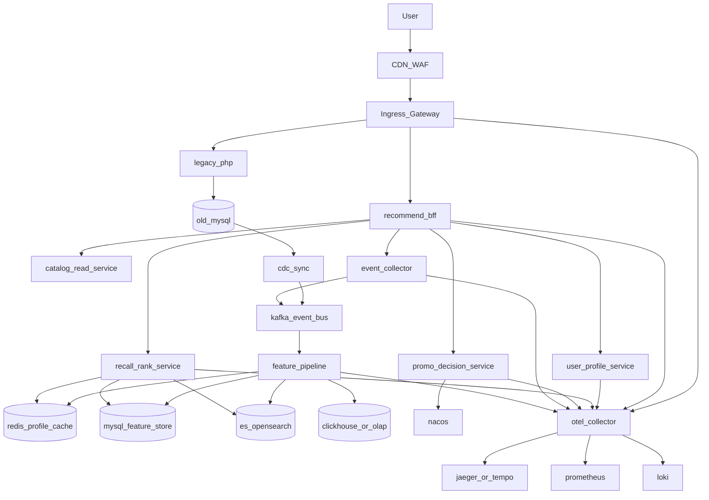
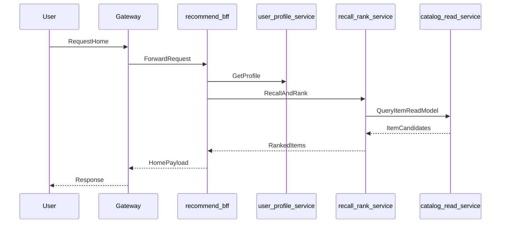
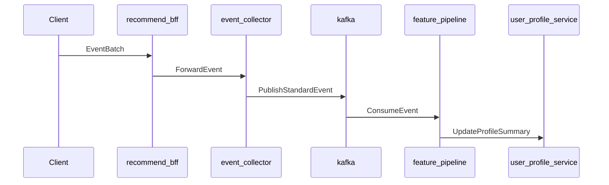

# 推荐系统总体架构

## 目标

在不改老 PHP 代码的前提下，建设一套可独立演进的 Go 推荐平台，先覆盖核心触点，再逐步扩展为未来全量 Go 化的展示、搜索、活动与画像基础域。

## 架构总览

## 服务边界

### `recommend-bff`

职责：

- 对外暴露推荐相关 HTTP 接口
- 聚合用户身份、画像结果、召回排序结果、活动结果
- 负责前端场景编排与兜底输出
- 统一注入 `trace_id`、`request_id`、`experiment_id`

不负责：

- 不直接做复杂排序
- 不直接维护画像
- 不直接读老库核心业务表

典型接口：

- `GET /api/v1/recommend/home`
- `GET /api/v1/recommend/search/rerank`
- `GET /api/v1/recommend/category`
- `GET /api/v1/recommend/item/related`
- `GET /api/v1/recommend/promo`
- `POST /api/v1/events/batch`

### `user-profile-service`

职责：

- 提供在线画像查询
- 提供画像标签读取
- 管理用户长期画像与短期兴趣摘要
- 输出统一画像视图给推荐和活动决策使用

画像维度建议：

- 基础画像：
  - user_id
  - region
  - register_days
  - customer_level
  - company_type
- 交易画像：
  - avg_order_price
  - order_frequency
  - recent_buy_categories
  - recent_buy_brands
- 行为画像：
  - recent_click_categories
  - recent_search_terms
  - recent_view_items
  - active_score
- 履约画像：
  - preferred_warehouse
  - preferred_delivery_area
  - stock_sensitivity

存储建议：

- 热数据：Redis
- 持久化：MySQL

### `recall-rank-service`

职责：

- 候选召回
- 规则过滤
- 粗排
- 精排
- 去重
- 多样性控制
- 兜底策略

召回通道建议：

- 热销召回
- 同类目召回
- 同品牌召回
- 同价位召回
- 历史购买相似召回
- 同区域可履约召回
- 营销活动召回
- 运营白名单召回

排序特征建议：

- 用户画像特征
- 商品类目与价格带特征
- 履约与库存特征
- 热度特征
- 运营加权
- 行为时效性特征

### `promo-decision-service`

职责：

- 个性化活动位决策
- 千人千券
- 弹窗与运营位策略
- A/B 实验分流
- 白名单/黑名单

依赖：

- 用户画像
- 活动规则
- Nacos 动态配置

### `event-collector`

职责：

- 接收客户端与 BFF 上报的事件
- 做基本校验与标准化
- 补充公共元信息
- 异步写入 Kafka

接收事件类型：

- 页面曝光
- 推荐结果曝光
- 点击
- 搜索
- 停留
- 加购
- 下单
- 支付成功

### `feature-pipeline`

职责：

- 消费行为与业务事件
- 更新短期兴趣画像
- 计算热门榜与趋势榜
- 刷新候选池
- 生成推荐离线特征与在线摘要

第一版实现建议：

- 先用 Go consumer 实现
- 维持简单可控的数据处理逻辑
- 不急于引入 Flink

### `catalog-read-service`

职责：

- 提供推荐专用商品读模型
- 聚合商品、类目、价格带、发货地、库存摘要等数据
- 统一屏蔽老库复杂结构

第一版数据来源：

- 老库旁路同步后生成读模型

## 请求链路

### 首页推荐

### 行为回流

## 触点接管顺序

### 第一批

- 首页推荐
- 搜索重排

原因：

- 业务价值最高
- 可快速体现千人千面效果
- 对接方式清晰
- 能优先打通曝光、点击、搜索和下单回流

### 第二批

- 类目重排
- 商品详情相关推荐

原因：

- 可以复用已建好的召回与排序能力
- 对用户转化有持续增益

### 第三批

- 个性化活动位
- 千人千券
- 弹窗/运营位策略

原因：

- 依赖更成熟的画像与实验配置
- 与运营配置耦合更强

## 关键设计原则

### 先分层，再升级算法

- 第一版先做好召回、排序、重排的职责分层
- 先用规则和特征打分
- 后续模型化排序只替换排序内核，不推翻接口和服务边界

### 在线服务只做轻计算

- 在线路径只做：
  - 画像读取
  - 候选召回
  - 轻量排序
  - 结果缓存
- 重计算放到异步 pipeline

### 推荐必须可追溯

每次推荐请求都应带出：

- request_id
- trace_id
- scene
- experiment_id
- strategy_id
- feature_version

### 所有触点都要保底

任何触点在推荐服务异常时，必须有：

- 热榜兜底
- 白名单兜底
- 类目默认兜底
- 静态配置兜底

## 第一版技术取舍

### 做

- 规则召回
- 特征打分
- 分钟级画像更新
- Kafka 事件流
- Redis 热缓存
- OpenTelemetry 全链路埋点

### 暂不做

- 复杂模型训练平台
- 特征平台全量化
- 向量检索
- 多模型在线推理网关
- 大规模实时流计算平台

## 后续演进方向

当老系统逐步迁移到 Go 后，这套架构可以直接扩展为：

- 展示层由 Go 完全接管
- 搜索服务独立
- promotion 与 recommendation 分域治理
- catalog 由只读模型升级为主商品域服务
- profile 进一步沉淀为统一用户增长与运营底座
