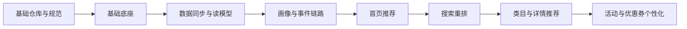

# 实施清单与里程碑

## 目标

把“千人千面先行”方案拆成可以直接执行的工程任务，覆盖：

- 仓库骨架
- 服务脚手架
- 接口清单
- 事件清单
- 部署清单
- 开发顺序

## 总体实施顺序

## 第一阶段：仓库与基础骨架

### 交付内容

- Monorepo 目录落地
- 基础文档落地
- 服务目录落地
- `api/proto` 与 `api/openapi` 目录落地
- `pkg` 公共组件目录落地
- `deploy/k8s` 与 `deploy/helm` 目录落地

### 需要补齐的首批文件

- 根 `go.mod`
- 根 `Makefile`
- 根 `README.md`
- `.gitignore`
- `golangci` 配置
- CI 配置文件

### 服务脚手架优先级

1. `recommend-bff`
2. `event-collector`
3. `user-profile-service`
4. `catalog-read-service`
5. `recall-rank-service`
6. `feature-pipeline`
7. `promo-decision-service`

## 第二阶段：基础底座

### 公共组件包优先顺序

#### `pkg/observability`

目标：

- 统一日志初始化
- OTel tracer 初始化
- metrics 注册
- trace context 透传工具

第一批能力：

- logger factory
- trace middleware
- metrics middleware
- request context helpers

#### `pkg/config`

目标：

- 统一读取本地配置、环境变量、Nacos 动态配置

第一批能力：

- base config loader
- nacos client wrapper
- env override
- dynamic config watch

#### `pkg/auth`

目标：

- 统一 user context
- 登录态识别
- anonymous_id 生成

第一批能力：

- user context model
- legacy identity parser interface
- request identity middleware

#### `pkg/mq`

目标：

- 封装 Kafka producer/consumer
- 透传 trace 上下文

第一批能力：

- producer wrapper
- consumer wrapper
- retry/dead-letter hooks

#### `pkg/experiment`

目标：

- 实验分桶
- 策略版本管理
- 白名单/灰度封装

## 第三阶段：接口与契约

## `OpenAPI` 首批接口

### `recommend-bff`

- `GET /api/v1/recommend/home`
- `GET /api/v1/recommend/search/rerank`
- `GET /api/v1/recommend/category`
- `GET /api/v1/recommend/item/related`
- `GET /api/v1/recommend/promo`
- `POST /api/v1/events/batch`

### 首批请求参数建议

公共查询参数：

- scene
- user_id
- anonymous_id
- device_id
- session_id
- page
- page_size

搜索重排额外参数：

- query
- original_item_ids
- category_id
- sort_type

### 首批响应字段建议

- request_id
- trace_id
- experiment_id
- strategy_id
- feature_version
- fallback
- items

## `proto` 首批服务

### `profile.v1.ProfileService`

- `GetProfile`
- `BatchGetProfiles`
- `MergeAnonymousBehavior`

### `catalog.v1.CatalogReadService`

- `BatchGetItems`
- `GetItem`
- `ListItemsByCategory`

### `recommend.v1.RecallRankService`

- `RecommendHome`
- `RerankSearch`
- `RecommendRelatedItems`

### `promo.v1.PromoDecisionService`

- `GetPromoSlots`
- `GetCouponDecision`

### `event.v1.EventService`

- `PublishBehaviorEvents`

## 第四阶段：事件与画像

## 首批事件模型

### 必须先定义的事件

- `recommend_impression`
- `recommend_click`
- `search_submit`
- `search_result_impression`
- `search_result_click`
- `add_to_cart`
- `order_created`
- `payment_success`

### 事件开发顺序

1. `recommend_impression`
2. `recommend_click`
3. `search_submit`
4. `order_created`
5. `payment_success`

原因：

- 先能闭环推荐效果
- 再接交易结果做归因

## 首批画像字段

### `base profile`

- user_id
- anonymous_id
- region
- customer_level
- register_days

### `behavior summary`

- recent_view_items
- recent_click_categories
- recent_search_terms
- active_score

### `purchase summary`

- avg_order_price
- order_frequency_30d
- top_categories_30d
- top_brands_30d

## 第五阶段：服务最小可用版本

## `recommend-bff` MVP

MVP 目标：

- 提供首页推荐接口
- 提供搜索重排接口
- 提供事件上报接口
- 返回统一归因字段

不做：

- 复杂页面渲染
- 多端模板系统

## `event-collector` MVP

MVP 目标：

- 接收事件批量上报
- 补齐公共字段
- 写入 Kafka

## `user-profile-service` MVP

MVP 目标：

- 读取基础画像
- 读取行为摘要
- 读取购买摘要

## `catalog-read-service` MVP

MVP 目标：

- 返回推荐需要的商品读模型
- 支持按 item_id 批量查询

## `recall-rank-service` MVP

MVP 目标：

- 支持首页推荐
- 支持搜索结果重排
- 支持兜底逻辑

## `feature-pipeline` MVP

MVP 目标：

- 消费曝光、点击、搜索、下单、支付事件
- 刷新用户短期兴趣
- 刷新热门榜

## 第六阶段：部署清单

## K8s 首批资源

- namespace
- configmap
- secret
- deployment
- service
- ingress
- hpa

## 基础中间件首批依赖

- Nacos
- Kafka
- MySQL
- Redis
- Elasticsearch/OpenSearch
- OTel Collector
- Prometheus
- Grafana
- Loki
- Jaeger/Tempo

## 云资源建议

- 托管 K8s
- 托管 MySQL
- 托管 Redis
- 托管 Kafka
- 托管 ES/OpenSearch
- 对象存储
- KMS/Secret 管理

## 第七阶段：测试与验证

## 首批测试清单

### 单元测试

- 召回规则
- 排序打分
- 画像合并
- 实验分桶

### 集成测试

- Kafka 发布消费
- Redis 画像缓存读写
- MySQL 读模型查询
- ES 检索依赖

### 接口测试

- 首页推荐
- 搜索重排
- 事件上报

### 冒烟指标

- 推荐接口成功率
- 平均耗时
- fallback_rate
- Kafka lag
- 画像命中率

## 分阶段开发建议

### Sprint 1

- 仓库骨架
- 公共包骨架
- Nacos/OTel 接入方式
- 接口契约初稿

### Sprint 2

- 数据同步方案验证
- `catalog-read-service` MVP
- `user-profile-service` MVP
- `event-collector` MVP

### Sprint 3

- `recall-rank-service` MVP
- `recommend-bff` 首页推荐
- 曝光点击埋点闭环

### Sprint 4

- 搜索重排
- 交易归因闭环
- 灰度接入

### Sprint 5

- 类目重排
- 详情相关推荐
- 个性化活动位

## 编码前必须确认的清单

- 首批接管入口 URL
- 老登录态识别方式
- 老库 CDC 可行性
- 推荐展示端形态
- 托管云资源供应商
- 首页与搜索的产品规则

## 本轮已完成的实施准备

- 仓库骨架目录已建立
- 方案文档已按架构、规范、同步、实施拆分

## 下一步建议

确认本清单后，下一轮直接进入：

1. 根 `go.mod` 与 Monorepo 基础脚手架
2. `pkg/config`、`pkg/observability`、`pkg/auth` 公共包初始化
3. `recommend-bff`、`event-collector`、`user-profile-service` 首批服务脚手架
4. 首批 `proto` 与 `OpenAPI` 契约文件
5. K8s 基础部署模板
