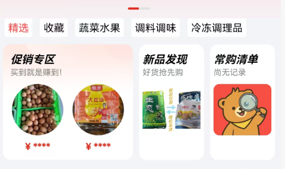
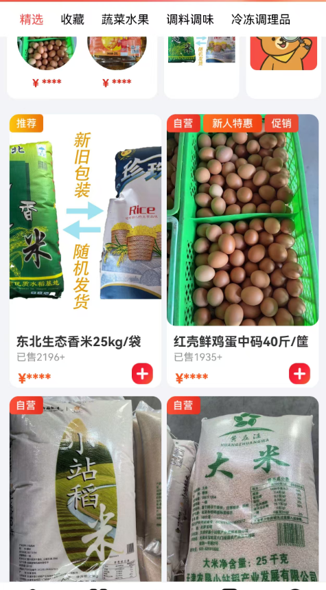
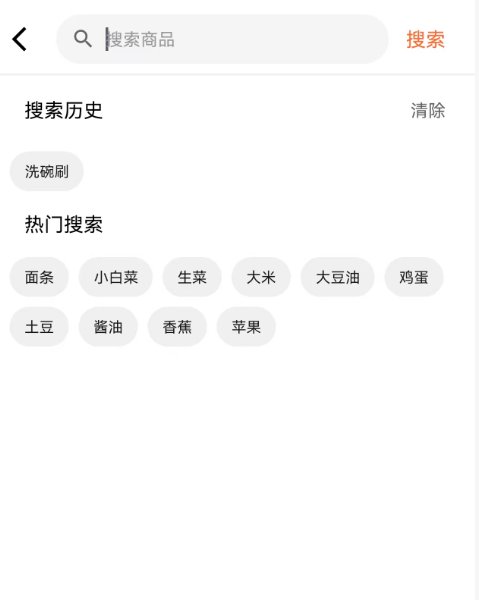
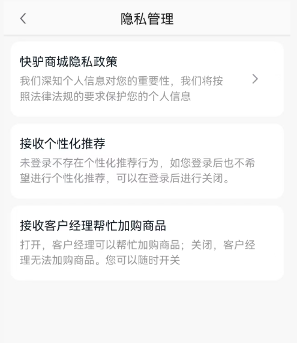

# 个性化推荐系统需求文档

## 一、概述

### 1.1 项目背景

三只熊零售作为面向中小餐饮商户的B2B采购平台，商户群体覆盖不同规模、菜系、经营时段，需求差异显著。传统“千人一面”的商品展示模式，导致商户采购决策成本高、供需匹配效率低，部分长尾商品曝光不足。通过构建“千人千面”个性化推荐系统，可基于商户行为数据与画像标签，实现精准商品推送，优化采购体验，挖掘潜在需求。

### 1.2 建设目标

- __短期目标__：上线核心推荐功能，实现首页、商品列表页的个性化展示，使商户点击率提升XX%，采购转化率提升XX%。
- __中期目标__：完善用户画像体系，拓展推荐场景至搜索结果、活动页、消息触达，使商户复购率提升X%，客单价提升X%。
- __长期目标__：构建智能营销闭环，实现全链路个性化服务，成为商户采购决策的核心辅助工具，提升平台市场竞争力。

## 二、用户画像体系

### 2.1 标签维度设计

#### 2.1.1 基础属性标签

- __商户基本信息__：商户类型（正餐、快餐、小吃、饮品等）、经营规模（门店面积、员工数量）、所在区域（城市、商圈、写字楼/社区/街边店）、营业时间（早餐/午餐/晚餐/夜宵）。
- __证照资质__：餐饮品类许可（中餐/西餐/火锅等）、经营年限。

#### 2.1.2 消费行为标签

- __采购习惯__：采购频率（日采/周采/月采）、采购时段（早高峰/午间/晚间）、客单价区间、累计采购金额。
- __商品偏好__：常购商品品类（粮油米面、生鲜果蔬、调料干货、酒水饮料等）、品牌偏好、规格偏好（大包装/小份装）、价格敏感度（倾向高端食材/高性价比商品/折扣商品）。
- __优惠券与活动参与__：优惠券使用频率（满减/折扣/新客券）、活动参与度（限时抢购/满赠/拼团）。

#### 2.1.3 互动行为标签

- __搜索行为__：搜索关键词、搜索频率、热门搜索品类。
- __浏览行为__：浏览页面类型（首页/分类页/商品详情页）、停留时长、浏览深度（是否进入详情页/加购）。
- __点击与收藏__：商品点击率、收藏商品/店铺类型、收藏率。
- __评价与反馈__：评价数量、评分、评价情感倾向（正面/负面）、反馈问题类型（质量/配送/服务）。

#### 2.1.4 预测性标签

通过机器学习算法生成，包括：潜在采购品类预测、采购周期预测、价格接受阈值、活动响应概率。

### 2.2 数据收集与处理

#### 2.2.1 数据来源

- __内部数据__：商户注册信息、订单数据、行为日志（搜索、浏览、点击、收藏）、评价数据、客服沟通记录。
- __外部数据__：第三方餐饮行业报告、区域消费趋势数据、天气数据（影响生鲜采购需求）、节假日数据。

#### 2.2.2 数据处理流程

1. __数据清洗__：剔除无效数据（如重复订单、误操作点击）、补全缺失字段、修正异常值（如超低价采购记录）。
2. __数据统计与归类__：按标签维度对数据进行聚合统计，如计算商户月采购频率、常购品类占比。
3. __标签生成__：基于规则引擎与机器学习算法生成标签，如通过采购记录识别商品偏好，通过浏览时长预测潜在需求。
4. __数据更新__：基础属性标签实时更新，行为标签按日更新，预测性标签按周迭代，确保画像时效性。

## 三、核心功能需求

### 3.1 个性化推荐场景

#### 3.1.1 首页推荐

- __核心模块__：“新品发现”商品栏、促销专区、常购清单快捷入口。
- __推荐逻辑__：结合商户常购品类、最近采购记录、潜在需求预测，优先展示高匹配度商品；根据商户采购时段，提前推送当日所需食材（如早餐店早7点推荐包子馅料、豆浆原料）。

#### 3.1.2 商品列表页推荐

- __排序规则__：默认按“个性化推荐”排序，综合商品匹配度、商户偏好、销量、价格因素；支持商户切换“价格从低到高”“销量从高到低”等排序方式。
- __筛选优化__：根据商户画像智能推荐筛选条件，如对火锅店商户优先展示“火锅底料”“牛羊肉”筛选标签。

#### 3.1.3 搜索结果页推荐

- __联想词推荐__：输入关键词时，根据商户历史搜索与采购偏好，推送个性化联想词（如商户常购“大米”，输入“米”时推荐“东北大米10kg”“有机大米5kg”）。
- __结果个性化排序__：优先展示与商户需求匹配的商品，如西餐厅搜索“食用油”时，优先推荐橄榄油而非大豆油。

#### 3.1.4 消息触达推荐

- __推送内容__：个性化商品上新通知、专属优惠券（如对高价格敏感度商户推送折扣券，对常购品牌商户推送新品券）、补货提醒（根据采购周期提醒常购商品补货）。
- __推送渠道__：APP消息推送、短信、微信公众号，根据商户活跃渠道偏好选择触达方式。

### 3.2 推荐算法策略

#### 3.2.1 基础算法

- __协同过滤__：基于用户相似性（如经营同品类、采购习惯相似的商户）推荐商品；基于商品相似性（如与常购商品搭配的食材）推荐关联商品。
- __内容推荐__：分析商品属性（品类、品牌、规格）与用户标签匹配度，精准推送符合偏好的商品。

#### 3.2.2 进阶算法

- __时序特征提取__：通过滑动窗口分析商户采购行为的时间规律（如每周五采购周末备货食材），提前推送对应商品。
- __场景化推荐__：结合外部因素（天气：高温时推荐冷饮原料；节假日：端午节推荐粽子食材、中秋节推荐月饼原料）生成场景化推荐列表。

#### 3.2.3 算法优化机制

- __实时反馈__：根据商户对推荐商品的点击、加购、购买行为，实时调整推荐权重，提升后续推荐准确性。
- __A/B测试__：定期对不同推荐算法、展示样式进行A/B测试，基于点击率、转化率数据优化策略。

### 3.3 商户自定义功能

- __推荐屏蔽__：支持商户屏蔽特定品类、品牌或商品，避免重复推送不需要的内容。
- __偏好设置__：商户可手动设置采购偏好（如“优先推荐有机食材”“只看折扣商品”），系统将结合设置调整推荐逻辑。

## 四、非功能需求

### 4.1 性能需求

- __响应速度__：推荐结果加载时间≤2秒，确保商户操作流畅。
- __并发处理__：支持峰值X万\+商户同时访问，系统无卡顿、崩溃。

### 4.2 数据安全需求

- __隐私保护__：严格遵守《个人信息保护法》，商户数据加密存储，仅用于推荐模型训练与个性化服务，不得泄露给第三方。
- __权限控制__：内部员工按角色分配数据访问权限，禁止越权查看商户敏感信息。

### 4.3 可扩展性需求

- __标签体系扩展__：支持新增标签维度（如商户供应链稳定性、线上化运营程度），适应业务发展需求。
- __算法扩展__：预留算法接口，可快速接入新的推荐模型与策略。

## 五、实施路径

### 5.1 第一阶段：基础搭建（1\-2个月）

- 完成用户画像核心标签体系建设，实现基础数据收集与处理。
- 上线首页“为你推荐”模块，采用协同过滤与内容推荐算法。
- 完成A/B测试框架搭建，启动首轮算法效果测试。

### 5.2 第二阶段：场景拓展（3\-4个月）

- 拓展推荐场景至商品列表页、搜索结果页、消息触达。
- 引入时序特征提取与场景化推荐算法，优化推荐精准度。
- 上线商户自定义功能（推荐屏蔽、偏好设置）。

### 5.3 第三阶段：闭环优化（5\-6个月）

- 构建“洞察\-策略\-触达\-优化”智能营销闭环，实现个性化活动推送。
- 完善算法迭代机制，基于商户反馈与数据持续优化推荐效果。
- 输出商户画像分析报告，为运营决策提供数据支持。

## 六、应用场景与业务价值

### 6.1 精准营销

- __个性化活动推送__：针对高潜力商户推送专属满减活动，针对流失风险商户推送召回优惠券，提升活动转化率。
- __新品推广__：根据商户品类偏好精准推送新品食材，如向川菜馆推荐新口味辣椒调料，新品销量提升。

### 6.2 用户体验优化

- __降低采购决策成本__：商户首页直接展示所需商品，减少搜索与筛选时间，采购效率提升。
- __挖掘潜在需求__：通过推荐算法发现商户未明确表达的需求，如向常购火锅食材的商户推荐特色蘸料，拓展商户采购品类。

### 6.3 运营效率提升

- __商品资源合理分配__：长尾优质商品通过个性化推荐获得曝光，库存周转效率提升。
- __精细化运营__：基于用户画像对商户分层运营，针对不同群体制定差异化策略，运营资源利用率提升。

## 七、风险与应对措施

### 7.1 数据质量风险

- __风险描述__：数据缺失、不准确导致画像标签错误，推荐效果不佳。
- __应对措施__：建立数据质量监控体系，定期校验数据准确性；通过商户反馈渠道收集标签修正请求，人工干预优化画像。

### 7.2 算法偏差风险

- __风险描述__：算法过度推荐某类商品，导致商户采购品类单一，影响体验。
- __应对措施__：设置推荐多样性阈值，确保推荐列表涵盖不同品类；引入人工审核机制，定期抽检推荐结果。

### 7.3 商户接受度风险

- __风险描述__：部分商户对个性化推荐存在疑虑，担心推荐商品不符合需求。
- __应对措施__：上线推荐说明功能，向商户解释推荐逻辑；提供“不感兴趣”按钮，允许商户快速调整推荐内容，同时收集反馈优化算法。

## 八、运营指标

评估“千人千面”策略的效果，核心在于构建“用户侧体验”与“平台侧业务”双维度的量化指标体系，并通过A/B测试进行归因分析。“千人千面”搜索策略的目标是实现“人\-货\-场”的精准匹配，其效果不能仅看整体流量或转化率，而需深入到个性化推荐的质量与效率。以下是具体的评估框架：

1、核心评估维度与指标 

（1）业务转化指标（平台价值） 

这些指标直接反映策略对商业目标的贡献。 

•‌搜索转化率（CVR）‌：完成搜索的用户中，最终下单购买的比例。这是最直接的成效指标，‌提升搜索转化率是“千人千面”策略的终极目标‌ 。 

计算口径为：用户通过搜索某一关键词后完成下单的次数，除以该关键词的总搜索次数，再乘以100%‌，即：

‌搜索转化率 = （搜索后成功下单的订单数 / 关键词被搜索的总次数）× 100%

•‌客单价（AOV）‌：通过个性化推荐，是否成功引导用户购买了更高价值的商品或进行了更多关联购买。 

客单价（AOV）计算口径为：平台在统计周期内的总销售额除以产生的订单总数‌，即：

‌AOV = 总销售金额 / 订单数量

•‌点击率（CTR）‌：搜索结果页中，商品被点击的次数与展示次数的比率。高CTR表明推荐结果对用户有吸引力 。 

点击率（CTR）的计算口径为：商品链接被点击的次数除以该内容被展示的总次数，再乘以100%‌，即：

‌CTR = \(点击次数 / 展示次数\) × 100%

（2）用户体验与相关性指标（用户价值） 

这些指标衡量推荐结果是否真正满足了用户的个性化需求。 

•‌跳出率/跳失率‌：用户进入搜索结果页后，未进行任何点击就离开的比例。低跳出率说明结果页内容与用户意图匹配度高 。 

•‌搜索后行为深度‌：用户在搜索后的平均浏览页数、停留时长。深度越深，说明用户在结果中找到了感兴趣的内容。 

•‌无结果率‌：用户搜索后未返回任何结果的比例。优秀的策略应通过语义理解、纠错和联想，将无结果率降至最低。 

（3）个性化质量指标（策略健康度） 

这些指标专门用于衡量“千人千面”算法本身的精准度和多样性。 

•‌推荐丰富度与多样性‌：评估结果页是否“千人千面”，避免“千人一面”。可通过计算不同用户搜索同一关键词时，其结果列表的重合度（Jaccard相似系数）来衡量。重合度越低，个性化程度越高 。 

•‌长尾商品曝光度‌：个性化策略是否只推热门商品，还是也能将小众但匹配用户需求的长尾商品推荐出去，这关系到平台生态的健康。 

•‌用户标签匹配度‌：通过抽样分析，评估展示给用户的商品，其商品标签（如价格、品牌、风格）与用户的人群标签（如消费能力、偏好）的匹配程度。 

2、关键评估方法：A/B测试 

单一指标的波动可能受多种因素影响，‌A/B测试是评估“千人千面”策略效果的黄金标准‌。 

•‌方法‌：将用户随机分为两组，对照组使用旧的搜索排序策略（如纯按销量排序），实验组使用新的“千人千面”策略。 

•‌对比‌：在相同的流量和时间下，对比两组在上述所有指标上的表现差异。 

•‌结论‌：如果实验组在搜索转化率、点击率等核心指标上显著优于对照组，且用户体验指标（如跳出率）得到改善，则证明新策略有效。
