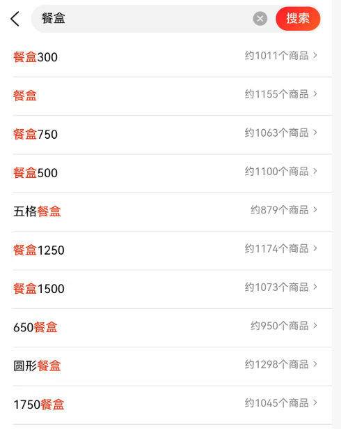
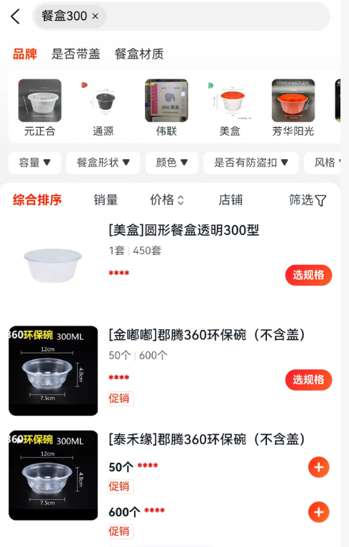
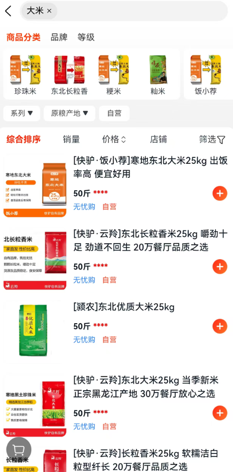

# 搜索结果页优化 PRD

## 一、概述

### 1.1 用户需求

搜索功能的核心需求是“快速找到满意的商品”。“快速”意味着搜索操作应尽量方便、快捷，减少用户交互成本；“满意”则要求搜索结果能精准匹配用户真实需求，平台需通过多种方式获取用户信息，以准确理解用户购买意向。用户使用搜索功能的典型路径为：点击搜索框触发搜索功能、输入关键词并触发搜索行为、浏览搜索结果并完成选择。

### 1.2 平台需求

平台希望通过搜索功能充分利用流量，刺激用户产生更多购买意向或行为，提高交易额。具体来说，要提高用户搜索意向转化为搜索行为的转化率，降低用户时间成本，提升搜索结果与用户真实意向的匹配度，在搜索各环节挖掘流量价值。

## 二、功能需求

### 2.1 搜索入口设计

搜索框需放置在 App 首页顶部显眼位置，当首页内容较长时，搜索框应固定在顶部，确保用户能快速发现并使用。搜索框内添加放大镜图标，无需额外文字提示，让用户直观识别搜索功能。同时，搜索框支持点击唤起输入界面，输入界面可展示最近搜索记录、热门搜索关键词等内容。

### 2.2 输入交互功能

#### 2.2.1 键盘适配

点击搜索框输入时，根据输入场景自动适配键盘类型。输入商品关键词时，弹出字母全键盘；若涉及数字输入（如价格搜索），自动切换为数字键盘。

#### 2.2.2 自动补全与联想

用户输入关键词过程中，实时显示可能的搜索词或商品名建议。建议词基于用户历史搜索记录、热门搜索词、商品数据等生成，按照相关性排序。当用户输入字符达到 2 个及以上时触发自动补全功能，补全列表最多展示 10 条建议，每条建议可附带搜索热度标识（如“热门”）。并且可直接链接到相应商品列表。

- **个性化联想策略**：结合用户历史搜索、浏览、购买记录，为不同用户展示差异化联想词。例如，经常购买母婴用品的用户输入“奶粉”，联想词优先展示其常购品牌的奶粉系列。
- **场景化联想**：根据时间、地域等场景生成联想词。如夏季输入“凉”，联想“凉席”“空调被”；在海鲜产地输入“海鲜”，联想当地特色海鲜品类。
- **品牌与品类联想**：输入品牌名时，联想该品牌旗下热门商品；输入品类词时，联想细分品类或关联品类，如输入“手机”，联想“智能手机”“手机壳”“手机充电器”。

#### 2.2.3 拼写纠错

对用户输入的关键词进行拼写检查，若存在明显拼写错误，自动给出纠正建议。例如，用户输入“苹菓”，系统提示“您是不是想找：苹果”，用户可点击纠正后的关键词进行搜索。

- **纠错优先级策略**：优先纠正与平台热门商品、用户历史搜索相关的拼写错误；对于生僻词或小众品牌，若纠错置信度低于 70%，不强制纠正，仅提供可选建议。
- **上下文纠错**：结合输入上下文判断纠错方向，如用户输入“iphon”，结合热门搜索优先纠正为“iPhone”，而非“iphon”的其他形近词。

### 2.3 搜索执行功能

#### 2.3.1 基础搜索

用户输入关键词并点击搜索按钮或按下回车键后，系统执行搜索操作，返回相关商品列表。搜索结果需综合考虑关键词与商品标题、描述、品牌等字段的相关性进行排序。

- **关键词匹配策略**：采用精确匹配与模糊匹配结合的方式。优先展示标题中完整包含关键词的商品，再展示标题部分包含关键词或描述、属性中包含关键词的商品。
- **权重分配**：商品标题匹配权重占 60%，品牌匹配占 20%，描述及属性匹配占 15%，用户行为数据（如点击、购买）占 5%。

#### 2.3.2 高级搜索（快驴目前没有，猜测是跟 B 端业务有关，建议学习快驴）

支持用户按价格区间、品牌、品类、销量、评价等多维度筛选搜索结果。筛选条件可在搜索结果页面侧边或顶部展示，用户可随时添加、修改筛选条件，系统实时更新搜索结果。

- **价格区间筛选**：提供输入框让用户自定义价格范围，同时设置常见价格区间选项（如「0–50 元」「50–100 元」等）供用户快速选择。价格区间选项可根据用户历史购买价格分布、平台商品价格分布动态调整。
- **品牌筛选**：展示热门品牌列表，支持用户输入品牌名称搜索，选中品牌后，搜索结果仅展示该品牌商品。热门品牌列表根据品牌销量、搜索热度实时更新。
- **品类筛选**：按照商品品类层级展示筛选菜单，用户可逐层选择细分品类，缩小搜索范围。品类菜单支持自定义展开/收起，同时展示各品类下的商品数量。
- **销量与评价筛选**：提供「按销量从高到低」「按评价从高到低」等排序选项，用户选择后，搜索结果重新排序。销量统计周期支持按近 7 天、近 30 天切换。

### 2.4 搜索结果展示

#### 2.4.1 结果列表展示

搜索结果以列表形式展示，每条结果包含商品图片、标题、价格、销量、评价星级等关键信息。商品图片清晰展示商品外观，标题简洁明了突出商品核心卖点，价格显示当前售价及原价（如有折扣），销量和商品受欢迎程度。

- **结果排序策略**：综合考虑相关性、销量、评价、价格、时效性等因素进行排序。新上架商品、促销商品可适当提高排序权重。
- **个性化排序**：根据用户历史浏览、购买记录，为用户展示个性化排序结果。例如，偏好低价商品的用户搜索“餐盒”，优先展示低价餐盒。

#### 2.4.2 无结果处理

当用户搜索无匹配结果时，展示友好的提示页面，避免让用户产生“走进死胡同”的体验。提示内容包括“未找到相关商品，可为您推荐以下相似品类商品”，同时展示相似品类的热门商品或个性化推荐商品，引导用户继续浏览。

- **无结果智能推荐策略**：基于用户搜索关键词的语义分析，推荐相关品类商品；结合用户历史行为，推荐用户可能感兴趣的其他商品；若搜索关键词存在歧义，提供关键词纠正选项，如用户输入“不存在的品牌名”，提示“您是否想搜索 XX 品牌”。

#### 2.4.3 结果分页与懒加载

搜索结果较多时，采用分页展示或懒加载方式。分页展示可设置每页展示 20 条商品，提供页码导航；懒加载则在用户滑动至页面底部时自动加载下一页内容，提升页面加载速度和用户体验。

- **预加载策略**：当用户浏览到当前页面的最后 5 条商品时，自动预加载下一页内容，减少用户等待时间。
- **加载失败处理**：若加载失败，展示“加载失败，请重试”提示，提供重试按钮，点击后重新加载对应页面内容。
